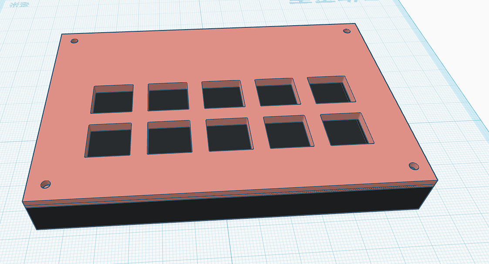
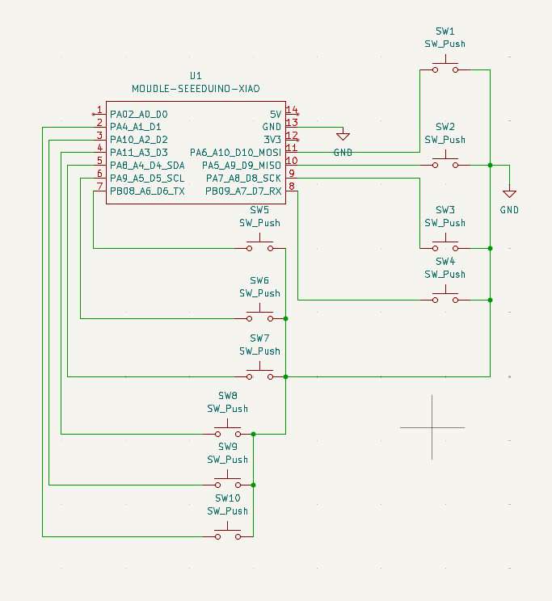
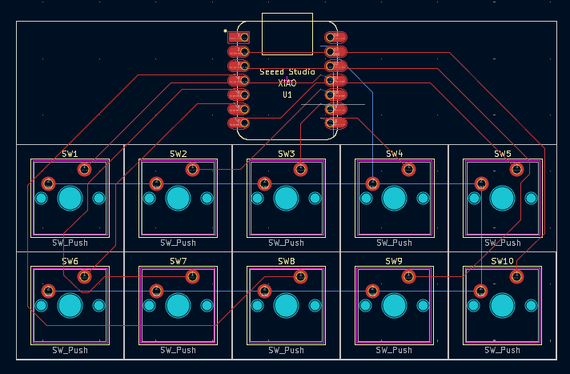
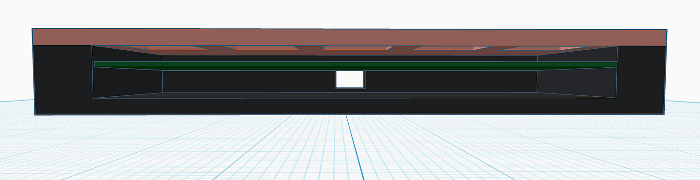

# 10-Key QMK Hackpad

A compact 10-key mechanical macropad designed for **daily computer use and live directing/broadcasting**.

The hackpad is powered by a **Seeed Studio XIAO RP2040** and runs **QMK Firmware**. Each key is assigned to a dedicated function key from **F13 to F22**, allowing the macropad to be used with software that supports custom keyboard shortcuts and macros.



## Features

* 10 programmable mechanical keys
* Seeed Studio XIAO RP2040
* QMK Firmware
* F13–F22 key mapping
* Direct GPIO connection for each key
* No keyboard matrix
* No switching diodes
* Compact and portable design
* Designed for daily computer use
* Designed for live directing and broadcasting
* Custom PCB
* Custom case designed in Tinkercad
* USB connection

## Intended Use

This hackpad was designed for **daily computer use** as well as **live directing and broadcasting**.

### Daily Use

The macropad provides ten additional function keys, F13–F22, which can be assigned to custom shortcuts in applications that support them.

This allows frequently used commands to be accessed without occupying the standard F1–F12 function keys.

### Live Directing / Broadcasting

The macropad can also be used as a compact control interface for live production.

For example, F13–F22 can be assigned in broadcasting or production software to functions such as:

* Scene switching
* Start / stop recording
* Audio controls
* Microphone mute
* Media playback
* Stream controls
* Production shortcuts
* Custom macros

The actual actions are assigned by the software being controlled, while the macropad simply sends the corresponding F13–F22 keycodes.

## Hardware

| Component                         | Quantity | Description            |
| --------------------------------- | -------: | ---------------------- |
| Seeed Studio XIAO RP2040          |        1 | Main microcontroller   |
| Cherry MX-style mechanical switch |       10 | User input             |
| MX-compatible keycap              |       10 | Keycaps                |
| Custom PCB                        |        1 | Main circuit board     |
| Custom case                       |        1 | Designed in Tinkercad  |
| USB cable                         |        1 | Connection to computer |

## Electrical Design

This macropad uses a simple **direct GPIO design** instead of a traditional keyboard matrix.

Each mechanical switch is connected directly to an individual GPIO pin on the XIAO RP2040.

Because every switch has its own GPIO connection, switching diodes are not required.

```text
SW1  ── GPIO
SW2  ── GPIO
SW3  ── GPIO
SW4  ── GPIO
SW5  ── GPIO
SW6  ── GPIO
SW7  ── GPIO
SW8  ── GPIO
SW9  ── GPIO
SW10 ── GPIO
```

This keeps the circuit simple and is suitable for a small 10-key macropad.

## Schematic

The schematic was designed in **KiCad**.

It contains the 10 mechanical switches and the XIAO RP2040, with each switch connected directly to an individual GPIO pin.



## PCB

The PCB was designed in **KiCad**.

It contains the 10 mechanical switch footprints, the XIAO RP2040 footprint, mounting features, and the required electrical connections.



## Case Design

The case was designed in **Tinkercad**.

It is designed to hold the PCB, switches, and keycaps while keeping the macropad compact and suitable for desktop use.

The case design also shows how the different components fit together during assembly.



## Completed Hackpad

The completed hackpad is shown below.


## Key Layout

The hackpad contains 10 physical keys mapped to the function keys **F13 through F22**.

| Key | Switch | QMK Keycode |
| --- | ------ | ----------- |
| 1   | SW1    | F13         |
| 2   | SW2    | F14         |
| 3   | SW3    | F15         |
| 4   | SW4    | F16         |
| 5   | SW5    | F17         |
| 6   | SW6    | F18         |
| 7   | SW7    | F19         |
| 8   | SW8    | F20         |
| 9   | SW9    | F21         |
| 10  | SW10   | F22         |


## Firmware

This project uses [QMK Firmware](https://qmk.fm/).

The current keymap assigns the 10 physical switches to F13–F22:

```text
SW1  → F13
SW2  → F14
SW3  → F15
SW4  → F16
SW5  → F17
SW6  → F18
SW7  → F19
SW8  → F20
SW9  → F21
SW10 → F22
```

Using F13–F22 keeps the macropad's controls separate from the standard F1–F12 function keys.

The keys can then be assigned to different functions inside compatible software, such as broadcasting, audio, media, editing, and productivity applications.

## GPIO Connections

Each switch is connected directly to an individual GPIO pin on the XIAO RP2040.

| Key | Switch |    GPIO | QMK Keycode |
| --- | ------ | ------: | ----------- |
| 1   | SW1    | GPIO 11 | F13         |
| 2   | SW2    | GPIO 10 | F14         |
| 3   | SW3    |  GPIO 9 | F15         |
| 4   | SW4    |  GPIO 8 | F16         |
| 5   | SW5    |  GPIO 7 | F17         |
| 6   | SW6    |  GPIO 6 | F18         |
| 7   | SW7    |  GPIO 5 | F19         |
| 8   | SW8    |  GPIO 4 | F20         |
| 9   | SW9    |  GPIO 3 | F21         |
| 10  | SW10   |  GPIO 2 | F22         |

> The GPIO assignments above should match the final QMK firmware configuration.

## Bill of Materials

The following BOM describes the actual hardware used in this project.

| Reference | Quantity | Component                         | Footprint / Notes                                    |
| --------- | -------: | --------------------------------- | ---------------------------------------------------- |
| SW1–SW10  |       10 | Cherry MX-style mechanical switch | `Button_Switch_Keyboard:SW_Cherry_MX_1.00u_PCB`      |
| U1        |        1 | Seeed Studio XIAO RP2040          | `HackclubPad:XIAO-Generic-Hybrid-14P-2.54-21X17.8MM` |
| —         |       10 | MX-compatible keycap              | Mechanical keyboard keycap                           |
| —         |        1 | Custom PCB                        | KiCad-designed                                       |
| —         |        1 | Custom case                       | Tinkercad-designed                                   |
| —         |        1 | USB cable                         | USB connection                                       |

### Electronics

The electronic components used in this project are:

* **1 × Seeed Studio XIAO RP2040**
* **10 × Cherry MX-style mechanical switches**

The switches are connected directly to individual GPIO pins.

No keyboard matrix is used, so no switching diodes are required.

### Mechanical Parts

The mechanical components are:

* **10 × MX-compatible keycaps**
* **1 × custom PCB**
* **1 × custom case**
* Screws or mounting hardware as required by the case design

## Design Goals

The main goal of this project is to create a small and practical macropad that can be used every day while also providing dedicated controls for live production.

The 10-key layout keeps the device compact while providing ten additional function keys that can be assigned to frequently used shortcuts and broadcasting functions.

The direct GPIO design keeps the electrical circuit simple and avoids the additional components required by a traditional keyboard matrix.

## Future Improvements

Possible future improvements include:

* RGB lighting
* Rotary encoder
* OLED display
* Additional QMK layers
* More advanced macros
* Dedicated broadcasting profiles
* Custom keycap legends
* Improved case design

## License

This project is open source. See the repository license for details.
